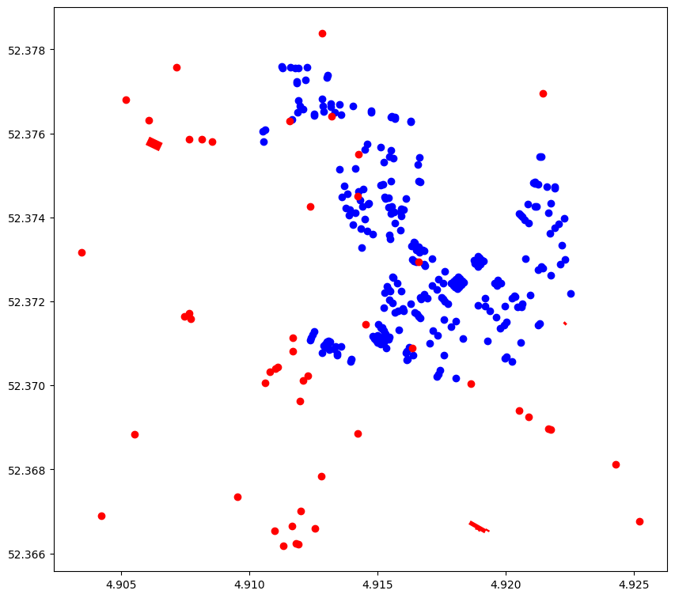

### Where will the swimming route go depending on the variables of Assignment 1?
In Assignment 1 we outlined several different dtaat set which together might provide a proxy for water quality and traffic meausres and thereby outlines where the potential swimming route could go.


To figure out the specific route we decided on a strating location with the zwimming water point close to ASM form there we created a code which would return a route circuling the area avoiding parts of the network which are red in the above picture.

```python
import osmnx as ox
ox.config(use_cache=True, log_console=True)

graph_water = ox.graph_from_place('Amsterdam', retain_all=False, truncate_by_edge=False,
                        simplify=True, custom_filter='["waterway"~"canal|river"]')

fig, ax = ox.plot_graph(graph_water)

node_id = list(graph_water.nodes)[0]
print(graph_water.nodes)
```
```python
import gpxpy
import gpxpy.gpx
import codecs

gpx_file = codecs.open('./swim_route.gpx', 'r', encoding='utf-8')
swim_route_gpx = gpxpy.parse(gpx_file)
gpx_file.close()
swim_route = []
for track in swim_route_gpx.tracks:
    for segment in track.segments:
        for point in segment.points:
            nearest_node = ox.distance.nearest_nodes(graph_water, point.longitude, point.latitude, return_dist=True)
            if nearest_node[1] < 10:
                swim_route.append(nearest_node[0])

swim_route_deduplicated = []
prev_elem = None
for elem in swim_route:
    if elem != prev_elem:
        swim_route_deduplicated.append(elem)
    prev_elem = elem
print(swim_route_deduplicated)

import networkx as nx
swim_route_path = []
for i in range(len(swim_route_deduplicated) - 1):
    path = nx.shortest_path(graph_water, swim_route_deduplicated[i], swim_route_deduplicated[i+1])
    swim_route_path.extend(path[1:])
print(swim_route_path)
```
```python
bbox_ams_centre = (52.378324, 52.355264, 4.939041, 4.886169)
swim_route_fig, ax = ox.plot_graph_route(graph_water, swim_route_path, route_linewidth=2, route_color='red', show=True, orig_dest_size=2, bgcolor='white', node_color="lightblue", edge_color="lightblue", bbox=bbox_ams_centre, close=False)
```


For the event headquartes we decided to put it centrally in our routs since our route circles back onto itself.

```python
swim_route_nodes = []

for node in swim_route_path:
    swim_route_nodes.append(graph_water.nodes[node])

average_x = 0.0
average_y = 0.0
for node in swim_route_nodes:
    average_x = average_x + node['x']
for node in swim_route_nodes:
    average_y = average_y + node['y']

average_x = average_x / len(swim_route_nodes)
average_y = average_y / len(swim_route_nodes)

swim_route_fig, ax = ox.plot_graph_route(graph_water, swim_route_path, route_linewidth=2, route_color='red', show=False, orig_dest_size=2, bgcolor='white', node_color="lightblue", edge_color="lightblue", bbox=bbox_ams_centre, close=False)
water_center.plot(ax=ax, color="lightblue")
ax.scatter(average_x, average_y, s=100, c='red', marker='o', zorder=2)
plt.show()
```


### The closest Bus and Tram stops to the swimming location
We aim to find the buss and tram locations closest to the traffic route. The circumfrance considered is 1000m since we consider that somehwat realistic to walk to and drom the event. The bus stop locaiotns are taken from osmnx while the tram and metro stops come from Maps Amsterdma published by the Gemeente Amsterdam.

```python
x_coor = 52.372870
y_coor = 4.914240
center_point = (x_coor,y_coor)

tags = {'public_transport':['stop_position']}

features = ox.features.features_from_point(center_point, tags=tags, dist=300)

features.head()
features.info()

url_pol = "https://maps.amsterdam.nl/open_geodata/geojson_lnglat.php?KAARTLAAG=TRAMMETRO_PUNTEN_2022&THEMA=trammetro"
response_pol = requests.get(url_pol)
gdf_pol = gpd.read_file(response_pol.text)

x_coor = 52.372870
y_coor = 4.914240
target_point = Point(x_coor, y_coor)

gdf_pol['distance'] = gdf_pol['geometry'].apply(lambda stop: great_circle((x_coor, y_coor), (stop.y, stop.x)).meters)

closest_stops = gdf_pol.nsmallest(5, 'distance')
print(closest_stops)
```
```Python
fig, ax = plt.subplots(figsize=(200,200))
ax.set_aspect('equal')
ax.set_facecolor('white')

ew = get_edge_widths(G)
ox.plot_graph(G, edge_color='grey',
                        node_size=0, edge_linewidth=ew,
                        show=False, close=False, ax=ax,)
water.plot(ax=ax, color="lightblue")
features.plot(ax=ax, markersize = 5000, color ="darkgreen")
closest_stops.plot(ax=ax, markersize = 5000, color = "orange")

plt.savefig("publictransport.png")
```


Overall the capacity of the public transport is estimated through data. We have 5 buss stops wihtin 1 km, and 5 tram stops. Both pass between 5-10 times and hour thus allowing us to set up an average of 7.5. The capacity of a bus is 30 seatsand 30 standing places, whiel the capacity of a tram is 60 seats and a 125 standing spaces. Thus we have calculated the numeber of poepl which can be moved per hour below.

```Python
y=(5*7.5*185)+(5*5*60)
print(y)
```
8437.5, thus approximatly 8438 people can be transported per hour.

### Where do the buss and tram routes run?
The buss and tram routes are both taken from Maps Amsterdam. Here we selected for routes which are stopping at the stops previously identefied.

### The centrality of our route
The centrality of our route is calculated through X. We though this wa ssuitable because of Y.

### Resturant and Cafes in the area
To calculate the resturants in the area we intially use the osmnx tags to call for resturants, bars and cafes in the areas.

Then we aim to limit the network to 10 min walking distance approximatly. For this we calucated an average distance of 750/800 meters to cover the distance

```Python
time_in_seconds = 10*60
speed_ms = 4.5*1000/3600
print(time_in_seconds, speed_ms)
distance_cafe = time_in_seconds * speed_ms
print(distance_cafe)
```
Initially we call the street network of amsterdam. Form there we isolated for all nodes walking distance to set up a general limiting box which describes the walking distance from our end/start point. Then by limiting the retsurant data set for this bounding box and projecting it we can see what cafes, bars and resturants are within approximatly 10min walking distance.

```Python
x_coor = 52.372870
y_coor = 4.914240

point_graph = ox.graph.graph_from_point((x_coor, y_coor), dist = 750, network_type='all', dist_type = "network")
ox.plot_graph(point_graph)

gdf_nodes =ox.utils_graph.graph_to_gdfs(point_graph, nodes=True, edges=False, node_geometry=True, fill_edge_geometry=True)
gdf_nodes.head()

restaurant = ox.features_from_point((x_coor, y_coor), dist=750, tags={'amenity':['restaurant','pub', 'bar']})

fig, ax = plt.subplots(figsize=(10,10), sharex=True, sharey=True)

gdf_nodes.plot(color='blue', ax=ax)
restaurant.plot(color = 'red', ax=ax)
```


Red dots are all the cafes, resturants and bars. The blue dots are the nodes in the street network 10 min from our core location.

```Python
restaurant["x"] = restaurant.centroid.x
restaurant["y"] = restaurant.centroid.y

north_end = 52.378
south_end = 52.370
west_end = 4.910
east_end = 4.923

df_restaurant = restaurant[['name', 'x', 'y']].copy()

df_copy = df_restaurant[df_restaurant["x"]>= west_end].copy()
df_copy2 = df_copy[df_copy["x"]<= east_end].copy()
df_copy3 =df_copy2[df_copy2["y"]<= north_end].copy()
df_closeby_restaurant = df_copy3[df_copy3["y"]>= south_end].copy()

df_closeby_restaurant

fig, ax = plt.subplots(figsize=(200,200))
ax.set_aspect('equal')
ax.set_facecolor('white')

ew = get_edge_widths(G)
ox.plot_graph(G, edge_color='grey',
                        node_size=0, edge_linewidth=ew,
                        show=False, close=False, ax=ax,)
water.plot(ax=ax, color="lightblue")
resturants_gdf.plot(ax=ax, color ="red", markersize = 5000)

for _, row in resturants_gdf.iterrows():
        txt = row["name"],
        x, y, = row["geometry"].x, row["geometry"].y
        ax.text(x, y, txt, ha="right", va="bottom", fontsize =80)
plt.savefig("restaurantsnearby.png")
```

