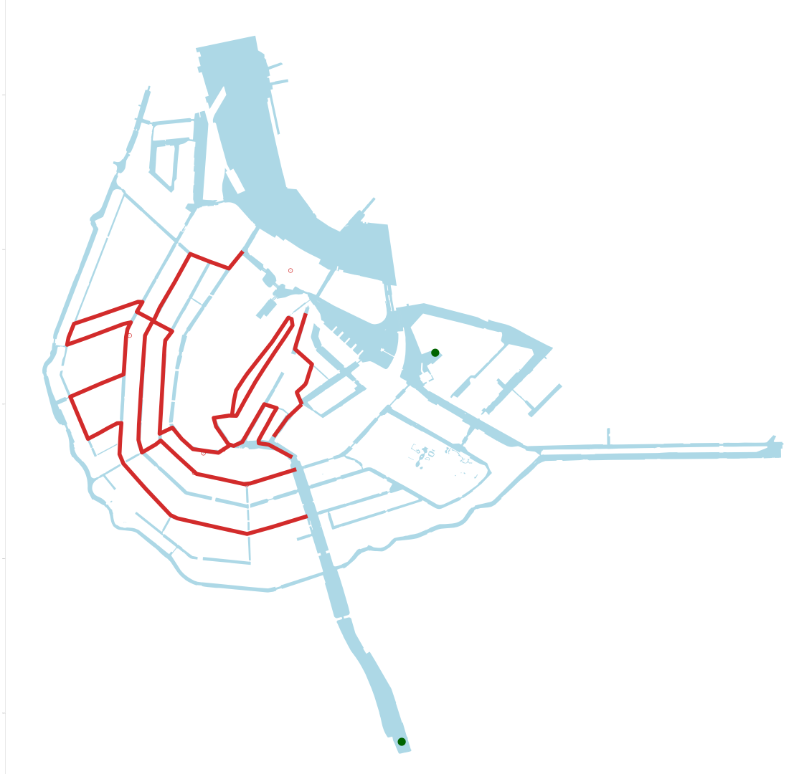

### Where will the swimming route go depending on the variables of Assignment 1?
In Assignment 1 we outlined several different data sets which together might provide a proxy for water quality and traffic measures. Thereby it can outline where the potential swimming route could go (Gemeente Amsterdam, n.d.).



To figure out the specific route we decided on a starting location with the swimming water point close to AMS which has a safe swimming location in front. From there we created a code which would return a route circuling the area avoiding parts of the network which are red in the above picture.

```python
import osmnx as ox
ox.config(use_cache=True, log_console=True)

graph_water = ox.graph_from_place('Amsterdam', retain_all=False, truncate_by_edge=False,
                        simplify=True, custom_filter='["waterway"~"canal|river"]')

fig, ax = ox.plot_graph(graph_water)

node_id = list(graph_water.nodes)[0]
print(graph_water.nodes)
```
```python
import gpxpy
import gpxpy.gpx
import codecs

gpx_file = codecs.open('./swim_route.gpx', 'r', encoding='utf-8')
swim_route_gpx = gpxpy.parse(gpx_file)
gpx_file.close()
swim_route = []
for track in swim_route_gpx.tracks:
    for segment in track.segments:
        for point in segment.points:
            nearest_node = ox.distance.nearest_nodes(graph_water, point.longitude, point.latitude, return_dist=True)
            if nearest_node[1] < 10:
                swim_route.append(nearest_node[0])

swim_route_deduplicated = []
prev_elem = None
for elem in swim_route:
    if elem != prev_elem:
        swim_route_deduplicated.append(elem)
    prev_elem = elem
print(swim_route_deduplicated)

import networkx as nx
swim_route_path = []
for i in range(len(swim_route_deduplicated) - 1):
    path = nx.shortest_path(graph_water, swim_route_deduplicated[i], swim_route_deduplicated[i+1])
    swim_route_path.extend(path[1:])
print(swim_route_path)
```
```python
bbox_ams_centre = (52.378324, 52.355264, 4.939041, 4.886169)
swim_route_fig, ax = ox.plot_graph_route(graph_water, swim_route_path, route_linewidth=2, route_color='red', show=True, orig_dest_size=2, bgcolor='white', node_color="lightblue", edge_color="lightblue", bbox=bbox_ams_centre, close=False)
```


We decided to put the headquarters central in our route since our route circles back onto itself.

```python
swim_route_nodes = []

for node in swim_route_path:
    swim_route_nodes.append(graph_water.nodes[node])

average_x = 0.0
average_y = 0.0
for node in swim_route_nodes:
    average_x = average_x + node['x']
for node in swim_route_nodes:
    average_y = average_y + node['y']

average_x = average_x / len(swim_route_nodes)
average_y = average_y / len(swim_route_nodes)

swim_route_fig, ax = ox.plot_graph_route(graph_water, swim_route_path, route_linewidth=2, route_color='red', show=False, orig_dest_size=2, bgcolor='white', node_color="lightblue", edge_color="lightblue", bbox=bbox_ams_centre, close=False)
water_center.plot(ax=ax, color="lightblue")
ax.scatter(average_x, average_y, s=100, c='red', marker='o', zorder=2)
plt.show()
```


### Use the centre to find a suitable spot for the event headquarters.
If we assume that the event headquarters should be on the water, we can find the nearest node on the water to the centre of the swim route. That would likely be a good place for the headquarters, because nodes are often placed at junctions of canals, which would provide more space for support boats and such.
```python
nearest_node = ox.distance.nearest_nodes(graph_water, average_x, average_y, return_dist=True)

# plot the swim route on top of the water graph
swim_route_fig, ax = ox.plot_graph_route(graph_water, swim_route_path, route_linewidth=2, route_color='red', show=False, orig_dest_size=2, bgcolor='white', node_color="lightblue", edge_color="lightblue", bbox=bbox_ams_centre, close=False)
water_center.plot(ax=ax, color="lightblue")
ax.scatter(graph_water.nodes[nearest_node[0]]['x'], graph_water.nodes[nearest_node[0]]['y'], s=100, c='red', marker='o', zorder=2)
plt.show()
```


This seems like a good location. There is good road access and the Entrepotdok offers sufficient space for support boats and structures.

### Finding closest Bus and Tram stops to the swimming location
We aim to find the bus and tram locations closest to the traffic route. The circumference considered is 1000m since we consider that somewhat realistic to walk to and from the event. The bus stop locations are taken from osmnx while the tram and metro stops come from Maps Amsterdam published by the Gemeente Amsterdam (Gemeente Amsterdam, 2023).

```python
x_coor = 52.372870
y_coor = 4.914240
center_point = (x_coor,y_coor)

tags = {'public_transport':['stop_position']}

features = ox.features.features_from_point(center_point, tags=tags, dist=300)

features.head()
features.info()

url_tram = "https://maps.amsterdam.nl/open_geodata/geojson_lnglat.php?KAARTLAAG=TRAMMETRO_PUNTEN_2022&THEMA=trammetro"
response_tram = requests.get(url_tram)
gdf_tram = gpd.read_file(response_tram.text)

x_coor = 52.372870
y_coor = 4.914240
target_point = Point(x_coor, y_coor)

gdf_tram['distance'] = gdf_tram['geometry'].apply(lambda stop: great_circle((x_coor, y_coor), (stop.y, stop.x)).meters)

closest_stops = gdf_tram.nsmallest(5, 'distance')
print(closest_stops)
```
```Python
fig, ax = plt.subplots(figsize=(200,200))
ax.set_aspect('equal')
ax.set_facecolor('white')

ox.plot_graph(G, edge_color='grey',
                        node_size=0, edge_linewidth=10,
                        show=False, close=False, ax=ax,)
water.plot(ax=ax, color="lightblue")
features.plot(ax=ax, markersize = 5000, color ="darkgreen")
closest_stops.plot(ax=ax, markersize = 5000, color = "orange")

plt.savefig("publictransport.png")
```


Overall, the capacity of public transport is estimated through data found online. We have 5 bus stops within 1 km, and 5 tram stops. Both pass between 5-10 times an hour thus allowing us to set up an average of 7.5. The capacity of a bus is 30 seats and 30 standing places, while the capacity of a tram is 60 seats and 125 standing spaces (GVB, 2023; Wikipedia-bijdragers, 2022). Thus we have calculated the number of people who can be moved per hour below.

```Python
y=(5*7.5*185)+(5*5*60)
print(y)
```
8437.5, thus approximatly 8438 people can be transported per hour.

### Where do the bus and tram routes run?
The bus routes are unable to be identified as osmnx is unable to return the routes to a specific bus id. However, Maps Amsterdam has an overview of all the tram lines. Thus we select the routes which are contained in our list of relevant trams and then graph them with different colours.
```Python
filtered = []
selected_routes = ["26", '7', '14', '51', '53', '54']

for ind in gdf_tram.index:
    for p in selected_routes:
        item = gdf_tram['Lijn'].loc[gdf_tram.index[ind]]
        item_str = str(item)
        if p in item_str:
            filtered.append(gdf_tram.loc[ind])

gdf_filtered = gpd.GeoDataFrame(filtered, columns= ['Modaliteit', 'Lijn', 'Lijn_select', 'geometry', 'Name', 'dtype'], geometry='geometry')

colour_routes = ["red", 'blue', 'darkgreen', 'purple', 'pink', 'yellow']
df_colour = pd.DataFrame([colour_routes], columns= ["26", '7', '14', '51', '53', '54'])

colour_items = []

for i in range(len(gdf_filtered)):
    for p in selected_routes:
        item = gdf_filtered['Lijn'].loc[gdf_filtered.index[i]]
        item_str = str(item)
        if p in item_str:
            colour_items.append(df_colour[p][0])
            break

gdf_filtered["colour"] = colour_items
```


### What is the centrality of our route? 
For this assignment, we are using closeness centrality. This notion of centrality is computed based on how close other nodes are to it and we computed it based on our street network.

We assume that this will allow us to consider how well other roads connect to our points and thus give us some type of estimation for how well foot/bike traffic will flow to and from our location.

```Python

endpoint_x = 52.372870
endpoint_y = 4.914240

center_x = average_x
center_y = average_y

streets_around_center = ox.graph.graph_from_point((endpoint_x, endpoint_y), dist = 750, network_type='all')

nearest_node = ox.distance.nearest_nodes(streets_around_center, endpoint_x, endpoint_y, return_dist=True)
print(nearest_node)
nearest_center_node = ox.distance.nearest_nodes(streets_around_center, center_x, center_y, return_dist=True)
print(nearest_center_node)

centrality_end = nx.closeness_centrality(streets_around_center,46364736)
centrality_center = nx.closeness_centrality(streets_around_center, 1024689023)
```
`The centrality of the finish and beginning is 0.027686988971731767, and the centrality of the headquarter is 0.041805298953587616`

Overall our relatively low number indicates that the starting and end point is pretty well connected as a lower centrality number means the nodes are better connected.

### Which restaurants and cafes are at a 10 min walk distance?
To calculate the restaurants in the area, we initially use the osmnx tags to call for restaurants, bars and cafes in the areas.

Then we aim to limit the network to 10 min walking distance approximately. For this, we calculated an average distance of 750/800 meters to cover the distance.

```Python
time_in_seconds = 10*60
speed_ms = 4.5*1000/3600
print(time_in_seconds, speed_ms)
distance_cafe = time_in_seconds * speed_ms
print(distance_cafe)
```
Initially, we call the street network of Amsterdam. From there, we isolated all nodes within walking distance by setting dist_type to 'network' which visualizes nodes that are 750 m away over the edges. With this, we set up a general limiting box that describes the walking distance from our end/start point. Then, by limiting the restaurant dataset for this bounding box and projecting it we can see what cafes, bars and restaurants are within approximately 10 min walking distance.

```Python
# Find the nearest node to the center of the swimming route
beggining_swim_route = swim_route_gpx.tracks[0].segments[0].points[0]
road_node_swim_route = ox.distance.nearest_nodes(sevenfiftym_network_graph, beggining_swim_route.longitude, beggining_swim_route.latitude, return_dist=False)

# Find all restaurants, pubs, and bars in a 750 metre radius to find all locations which could feasibly be in walking distance.
restaurant_sevenfifty = ox.features_from_point((x_coor, y_coor), dist=750, tags={'amenity':['restaurant','pub', 'bar']})

# Find the nearest node in the network graph for each horeca
for index, row in restaurant_sevenfifty.iterrows():  
    long = row['geometry'].centroid.x
    lat = row['geometry'].centroid.y
    nearest_node = ox.distance.nearest_nodes(sevenfiftym_network_graph, long, lat, return_dist=False)
    restaurant_sevenfifty.at[index, 'nearest_node'] = nearest_node

# For each horeca, find the shortest route to the center of the swimming route, and append it to the list
import networkx as nx
for index, row in restaurant_sevenfifty.iterrows():
    try:
        route_dist = nx.shortest_path_length(sevenfiftym_network_graph, source=row['nearest_node'], target=road_node_swim_route, weight='length')
        restaurant_sevenfifty.at[index, 'route_dist'] = route_dist
    except:
        restaurant_sevenfifty.at[index, 'route_dist'] = 800


# Remove all horeca that are more than 750 metres away from the center of the swimming route
for index, row in restaurant_sevenfifty.iterrows():
    if row['route_dist'] > 750:
        restaurant_sevenfifty.drop(index, inplace=True)
```
This gives us a dataframe with only the restaurants which are within 10 minutes walking distance. Then, in order to plot the restaurants on the map:

```Python
# We create a boundary polygon
north = 52.378
south = 52.370
west = 4.910
east = 4.923

boundary_polygon = Polygon([(west, north), (east, north), (east, south), (west, south), (west, north)])

# We get the water in the polygon
water = ox.geometries.geometries_from_bbox(north, south, east, west, tags={'natural' : 'water'})
water_bbox = water.clip(boundary_polygon)

# We get the roads in the polygon
G = ox.graph_from_bbox(north, south, east, west)
plt.savefig("restaurantsnearby.png")

# And we create a bounding box
bbox = [52.378, 52.370, 4.91, 4.923]
```
This code above prepares all the graphs we will need for our map. To make the map:
```python
# We plot the graph and overlay the horeca we found previously.
fig, ax = plt.subplots(figsize=(200,200))
ax.set_aspect('equal')
ax.set_facecolor('white')
ox.plot_graph(G, edge_color='grey',
                        node_size=0, edge_linewidth=10,
                        show=False, close=False, ax=ax,)
water.plot(ax=ax, color="lightblue")
swim_route_fig = ox.plot_graph_route(graph_water, swim_route_path, route_linewidth=100, zorder=2, route_color='red', show=False, orig_dest_size=0, bgcolor='white', node_size=0, edge_size=0, bbox=bbox, close=False, ax=ax)
restaurant_sevenfifty.plot(ax=ax, markersize = 5000, color = "orange")

for index, row in restaurant_sevenfifty.iterrows():
        txt = row["name"],
        x, y, = row["geometry"].x, row["geometry"].y
        ax.text(x, y, txt, ha="right", va="bottom", fontsize =130)

plt.savefig("./restaurantsnearby.png")
plt.show()
```


### References

Gemeente Amsterdam. (n.d.). Zwem- en speelwater. https://maps.amsterdam.nl/zwemwater/ 

Gemeente Amsterdam. (2023). Tram- en metronet 2023. https://maps.amsterdam.nl/trammetro/

GVB. (2023, May 4). Onze trams - over GVB. Over GVB. https://over.gvb.nl/ov-in-amsterdam/voer-en-vaartuigen/tram-in-cijfers/

Wikipedia-bijdragers. (2022). Stadsbus. Wikipedia. https://nl.wikipedia.org/wiki/Stadsbus#:~:text=Stadsbussen%20hebben%20minder%20zitplaatsen%20en,een%202%2B2%2Dstoelopstelling.