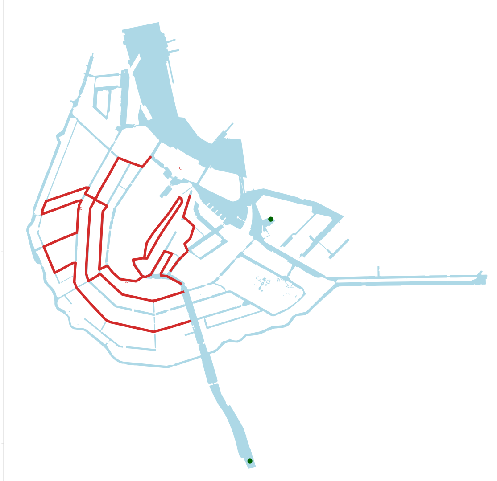

When considering data sources available on water quality and traffic in Amsterdam it's hard to find holistic and detailed data sets online. However, for this assignment we have considered a combination potential data sets available and other sources for information that could be combined to create a somewhat complete image, orat least a sufficient image to pick a route. We will first discuss potential datasets on marine traffic and then go over the possibilities for water quality, or quality approximations in Amsterdam. 

### Datasets for marine traffic 

When considering the need to not interfere with water transport we haven’t found much accesible raw data which can be used in python. However, we have found a pdf map which shows no go zones with a red sign and restricted areas for boat transport in pink, see picture below (Sloepdelen.nl, n.d.). The IJ is restricted likely due to the passage of large freigh traffic so we want to avoide that, but other restricted areas might actually be interesting for us since they will have less boat traffic. However, we cannot plot this map since it comes in a pdf format.


Similarly, on the platform marine traffic we can see a live feed of the main traffic all over the world (MarineTraffic, n.d. ). This also shows where boats move through amsterdam currently and over time. While this data is not available to us directly, through a scraper tool one could over time collect the data and make a detailed map of which canals are used and how much.This would liekly provide the most accrate data in the future however ot fot his porjetc. 

For this assignment we looked for data we could directly use for coding, even if that might mean some level of compromise in accuracy. Thus, we used a route set up on google maps which showed four main tourists routes to take when in Amsterdam. We assume that these four routes will likely cover the canals in amsterdam which are the most frequented for leisure traffic and thus where the race would have the most impact (Amsterdam Canal routes - Google my maps., 2023). This data is a geometric shapefile and originally comes as XML file, which we then converted to a GEOJSON file. Its a combination of lines and nodes, but visualized as an object later in this document.

### Datasets for water quality  

However, to consider feasibility of the event the main focus point is water quality. There are several different monitoring points in Amsterdam. However, the data is predominantly available seperatly in different websites specific to that area, thus we would have to pull it togetehr to one holistic data set manually or through a scraper (Gemeente Amsterdam, 2023; Van Roekel, 2022). Similarly, Waternet has a map which shows the oxygen and salt level in the canals of Amsterdam (Water in Kaart, n.d.). Again, this map is not downloadable and thus the information would have to be manually entered. Morover the latter information is less relevant to the concern of qater quality which predominantly focuses on the precense of E. Coli and blue algea.  

In research we found that the E. Coli bacteria mainly determines whether water quality is good enough, but we didn't find datasets on E.Coli concentrations (Van den Tillaart, 2022; Van Roekel, 2022). For the sake of this exercise, we have focused on creating proximiations for water quality through downloadable datasets and while they might not give a perfect image of areas in Amsterdam with clean water we think they work as an approximation. Zwimming water areas in combination with polder areas which are common overflow points of the sewage system are used to identifie good locations. This is crossreferenced with the city swimm to reconfirm that the area is indeed suitbale for big events (Amsterdam City Swim, n.d.).

Our primary starting point for water quality, is the map of possible swimming locations in Amsterdam (Gemeente Amsterdam, n.d.a). This data set can be downloaded in several formats but predominantly csv and GEOjson. Both are easily legible also without a program as they can be opened in Excel and an online browser. However, because this information is geographic in nature, for later processing the geographic format GEOjson is easier to use in Python. The file has point data but is set up as a standard number file. The file formats are both quite straightforward to open and geopandas or pandas are some of the most straightforward libraries in python that can probably read the data. For analysis plotly might be the best option to graph but for geographic analysis one should stick with geopandas. In addition, the mapbox plug-in with plotly or omnx data from OpenStreetMap, could be used to situate the points on a map. 

Overall, the file contains the name of the place, categories of the type of swim water (pool, official outdoor spot, etc), an ID code and the coordinates of the location. It is important to consider that this data set contains both indoor and outdoor locations which are safe for swimming. Thus, within these categories one should filter for outdoor locations and the canal. Furthermore, the file is semicolon delimited and has commas, which should be considered when reading it with pandas.

To supplement the official swimming locations a quick google search allows us to consider other commonly used and mointored swimming areas in amsterdam which might not appear in the official data set (I am Amsterdam. n.d). This gives us a broad set of locations to consider.

The Polder data is also taken from MapsAmsterdam (Haan, n.a.). This data is oftne in reserach considered a proxy from common overflow points into the canals from the sewage systems. Thus they might be more likely to be contaminated under rainy conditions. This data is also a shapefile in csv or GEOjson format. For our analysis we have vizualized it through GEOjson.


### Decision on best route

We plotted the possible swimming locations and the busiest canal boats traffic routes as well as polder areas in a map of Amsterdam (Amsterdam Canal Routes - Google my maps, n.d. ; Gemeente Amsterdam, n.d.). 
```python
city_name = "Amsterdam"
water = ox.geometries.geometries_from_place( city_name, tags={'natural' : 'water'})

url_pol = "https://maps.amsterdam.nl/open_geodata/geojson_lnglat.php?KAARTLAAG=RAINPROOF_POLDERRIOOL&THEMA=rainproof"
response_pol = requests.get(url_pol)
gdf_pol = gpd.read_file(response_pol.text)

gdf_boat = gpd.read_file("Amsterdam_canal_routes.geojson")

df_zwemwater =  pd.read_csv("ZWEMWATER.csv", sep = ";")
df_zwemplek = df_zwemwater[df_zwemwater['Categorie']=="Zwemplek"]
print(df_zwemplek.head())
gdf_zwemplek = gpd.GeoDataFrame(df_zwemplek[['OBJECTNUMMER', "LNG", "LAT", "Categorie"]],
    geometry=gpd.points_from_xy(df_zwemplek.LNG, df_zwemplek.LAT), crs="WGS84")

df_swimm =  pd.read_csv("Swimming.csv")
print(df_swimm.head())
gdf_swimm = gpd.GeoDataFrame(df_swimm[['place', "LNG", "LAT"]],
    geometry=gpd.points_from_xy(df_swimm.LAT, df_swimm.LNG), crs="WGS84")
      
fig, ax = plt.subplots(figsize=(200,200))
ax.set_aspect('equal')
ax.set_facecolor('#ffffff')

water.plot(ax=ax, color="lightblue")
gdf_zwemplek.plot(ax=ax, marker = 'o', markersize = 3000, color="lightgreen")
gdf_pol.plot(ax=ax, color= "#FF8700")
gdf_swimm.plot(ax=ax, marker = 'o', markersize = 3000, color="darkgreen")
gdf_boat.plot(ax=ax, color= "#D22B2B", linewidth = 20)

plt.savefig("waterways_amsterdam.png")
```


Many of the outdoor swimming spots as we can see are quite far out of the city center which is inconvenient if we consider accessibility by public transport and the location of hotels and airbnbs. Thus we have decided to focu the are we consider the the city center of Amsterdam.

```python
fig, ax = plt.subplots(figsize=(200,200))
ax.set_aspect('equal')
ax.set_facecolor('#ffffff')

water_center.plot(ax=ax, color="lightblue")
# all the zempleks in amsterdam are too far out of the city center thus to low connectivity
#gdf_zwemplek.plot(ax=ax, marker = 'o', markersize = 3000, color="#FFC300")
swimm_cent.plot(ax=ax, marker = 'o', markersize = 10000, color="darkgreen")
gdf_boat.plot(ax=ax, color= "#D22B2B", linewidth = 50)

plt.savefig("waterways_center_amsterdam.png")
```


 As we can see there is oen swimming location in the city center close to marinneterrain which we should conisder. In general we can see that this area of the maps also would avoid the main tourism canal trips. Futhermore this area was used for the CIty Swimm indivcating that its well suited bth quality and logisitcally for a large swimming even (Amsterdam City Swim, n.d.). For assignment 4, we thus decide to use AMS as a starting point and will create the route based on the canal traffic.

### References 

Amsterdam Canal routes - Google my maps. (n.d.). Google My Maps. https://www.google.com/maps/d/viewer?mid=1-isVe-eoiAiJj18lnT3cmeoLnbw&hl=en_US&ll=52.375187000000004%2C4.8828430000000145&z=15 

Amsterdam City Swim. (n.d.). Locatie and Route. Retrieved October 10, 2023, from https://www.amsterdamcityswim.nl/informatie/locatie-en-route

Gemeente Amsterdam. (n.d.). Zwem- en speelwater. https://maps.amsterdam.nl/zwemwater/ 

Gemeente Amsterdam. (2023). Waterkwaliteit Sloterstrand. Retrieved October 10, 2023, from  https://www.amsterdam.nl/toerisme-vrije-tijd/parken/sloterpark/waterkwaliteit-sloterplas/ 

Haan, G. A. K.-B. de. (n.d.). Amsterdam rainproof. Naar startpagina Maps Amsterdam. https://maps.amsterdam.nl/rainproof/ 

I am Amsterdam. (n.d.). Outdoor swimming spots in Amsterdam. I amsterdam. https://www.iamsterdam.com/en/see-and-do/nature-and-active/outdoor-swimming-spots-in-amsterdam 

MarineTraffic. (n.d.).  https://www.marinetraffic.com/en/ais/home/centerx:4.910/centery:52.375/zoom:1 

Sloepdelen.nl. (n.d.). Sailing rules on the water. Retrieved, October 10, 2023 from https://sloepdelen.nl/downloads/information_amsterdam_en.pdf 

Van Roekel, A. (2022, April 29). Bekijk: Koel, helder grachtenwater. NEMOKennislink. https://www.nemokennislink.nl/publicaties/koel-helder-grachtenwater/ 

Van den Tillaart, A. (2017, February). (Swim) water quality modelling in the city of Amsterdam. [Master's thesis, Wageningen University.] 

Water in Kaart. Waternet. (n.d.). https://www.waternet.nl/ons-water/oppervlaktewater/water-in-kaart/ 