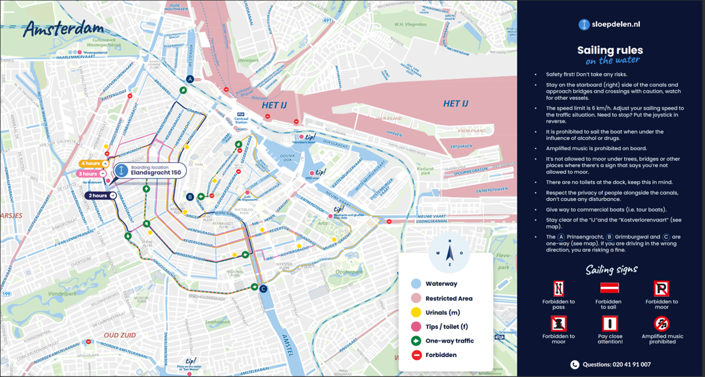

It is hard to find holistic and detailed data sources on water quality and traffic online. However, for this assignment, we have considered a combination of potential datasets available and other sources for information. Those could be combined to create an acceptable image that we can use to pick a route. In the section below we will first discuss potential datasets on marine traffic and then go over the possibilities for sources to assess water quality in the canals.  

### Datasets for marine traffic 

As explained, we haven't found much accessible raw data that could be used in Python to assess marine traffic in the canals. We did find a PDF map which shows no-go zones with a red sign and restricted areas for boat transport in pink, see the picture below (Sloepdelen.nl, n.d.). The IJ is restricted likely due to the passage of large freight traffic so we want to avoid that. However, other restricted areas might actually be interesting for us since they will have less boat traffic. Since it's the map is a PDF format, we can't plot this.



Similarly, on the platform Marine Traffic, we can see a live feed of the main traffic all over the world (MarineTraffic, n.d. ). This also shows where boats move through Amsterdam currently and over time. While this data is not available to us directly, through a scraper tool one could collect the data and make a detailed map of which canals are used the most over time. This would likely provide the most accurate data. We believe that we would need more experience to execute this plan. 

As explained, we mainly looked for data we could directly use for coding, even if that might mean some level of compromise in accuracy. Thus, we used a route set up on Google Maps which showed the four main routes of tourist boats in Amsterdam (Amsterdam Canal routes - Google my maps., 2023). We assume that these four routes will likely cover the canals in Amsterdam that are used the most for leisure traffic. We want to avoid those canals because closing them would have a lot of impact on leisure boat companies, tourists and other stakeholders. This data is a geometric shapefile and originally came as a XML file, which we then converted to a GEOJSON file. It's a combination of lines and nodes but visualized as an object later in this document.

### Datasets for water quality  

The main focus point to consider the feasibility of the event is water quality. The route needs to be safe so the swimmers stay healthy. 
There are several different monitoring points for water quality in Amsterdam. However, the data is predominantly available separately on different websites specific to that area, thus we would have to pull it together into one holistic data set manually or through a scraper (Gemeente Amsterdam, 2023). Similarly, Waternet has a map which shows the oxygen and salt levels in the canals of Amsterdam (Water in Kaart, n.d.). Again, this map is not downloadable and thus the information would have to be manually entered. Moreover, the latter information in determining whether water quality is good enough for swimming.

In research, we found that the E. Coli bacteria mainly determine whether water quality is good enough for swimming, but we didn't find datasets on E. coli concentrations (Van den Tillaart, 2022; Van Roekel, 2022). For the sake of this exercise, we have focused on creating approximations for water quality through downloadable datasets. Swimming water areas in combination with polder areas which are common overflow points of the sewage system are used to identify good locations. This is cross-referenced with the city swim to reconfirm that the area is indeed suitable for big events (Amsterdam City Swim, n.d.).

Our primary starting point for water quality is the map of possible swimming locations in Amsterdam (Gemeente Amsterdam, n.d.a). This data set can be downloaded in several formats but predominantly in CSV and GEOjson. Both are easily legible without a program as they can be opened in Excel and an online browser. However, because this information is geographic in nature, for later processing the geographic format GEOjson is easier to use in Python. The file has point data but is set up as a standard number file. The file formats are both quite straightforward to open and geopandas or pandas are some of the most straightforward libraries in Python that can read the data. Moreover, plotly might be a good option for analysis. Geopandas is useful for geographic analysis and in addition, the Mapbox plug-in with plotly or omnx data from OpenStreetMap, could be used to situate the points on a map. 

Overall, the file contains the name of the place, categories of the type of swim water (pool, official outdoor spot, etc), an ID code and the coordinates of the location. It is important to consider that this data set contains both indoor and outdoor locations which are safe for swimming. Thus, within these categories, one should filter for outdoor locations and the canal. Furthermore, the file is semicolon-delimited and has commas, which should be considered when reading it with pandas.

To supplement the official swimming locations a quick Google search allows us to consider other commonly used and monitored swimming areas in Amsterdam which might not appear in the official data set (I am Amsterdam. n.d). This gives us a broad set of locations to consider.

The Polder data is also taken from MapsAmsterdam (Haan, n.a.). This data is often in research considered a proxy from common overflow points into the canals from the sewage systems. Thus, they might be more likely to be contaminated under rainy conditions. This data is also a shapefile in CSV or GEOjson format. For our analysis, we have visualized it through GEOjson.


### Decision on best route

In order to find the best swimming route, we plotted the possible swimming locations, the busiest canal boats traffic routes and polder areas in a map of Amsterdam (Amsterdam Canal Routes - Google my maps, n.d. ; Gemeente Amsterdam, n.d.). 
```python
city_name = "Amsterdam"
water = ox.geometries.geometries_from_place( city_name, tags={'natural' : 'water'})

url_pol = "https://maps.amsterdam.nl/open_geodata/geojson_lnglat.php?KAARTLAAG=RAINPROOF_POLDERRIOOL&THEMA=rainproof"
response_pol = requests.get(url_pol)
gdf_pol = gpd.read_file(response_pol.text)

gdf_boat = gpd.read_file("Amsterdam_canal_routes.geojson")

df_zwemwater =  pd.read_csv("ZWEMWATER.csv", sep = ";")
df_zwemplek = df_zwemwater[df_zwemwater['Categorie']=="Zwemplek"]
print(df_zwemplek.head())
gdf_zwemplek = gpd.GeoDataFrame(df_zwemplek[['OBJECTNUMMER', "LNG", "LAT", "Categorie"]],
    geometry=gpd.points_from_xy(df_zwemplek.LNG, df_zwemplek.LAT), crs="WGS84")

df_swimm =  pd.read_csv("Swimming.csv")
print(df_swimm.head())
gdf_swimm = gpd.GeoDataFrame(df_swimm[['place', "LNG", "LAT"]],
    geometry=gpd.points_from_xy(df_swimm.LAT, df_swimm.LNG), crs="WGS84")
      
fig, ax = plt.subplots(figsize=(200,200))
ax.set_aspect('equal')
ax.set_facecolor('#ffffff')

water.plot(ax=ax, color="lightblue")
gdf_zwemplek.plot(ax=ax, marker = 'o', markersize = 3000, color="lightgreen")
gdf_pol.plot(ax=ax, color= "#FF8700")
gdf_swimm.plot(ax=ax, marker = 'o', markersize = 3000, color="darkgreen")
gdf_boat.plot(ax=ax, color= "#D22B2B", linewidth = 20)

plt.savefig("waterways_amsterdam.png")
```


Many of the outdoor swimming spots as we can see are quite far out of the city centre which is inconvenient if we consider accessibility by public transport and the location of hotels and airbnbs. Thus we have decided to focus on possible routes in the city center of Amsterdam.

```python
fig, ax = plt.subplots(figsize=(200,200))
ax.set_aspect('equal')
ax.set_facecolor('#ffffff')

water_center.plot(ax=ax, color="lightblue")
# all the zempleks in amsterdam are too far out of the city center thus to low connectivity
#gdf_zwemplek.plot(ax=ax, marker = 'o', markersize = 3000, color="#FFC300")
swimm_cent.plot(ax=ax, marker = 'o', markersize = 10000, color="darkgreen")
gdf_boat.plot(ax=ax, color= "#D22B2B", linewidth = 50)

plt.savefig("waterways_center_amsterdam.png")
```


  As we can see there is one swimming location in the city centre close to Marineterrain which we should consider. In general, we can see that this area of the maps would also avoid the main tourism canal trips. Furthermore, this area was used for the City Swimm which indicates that it is well-suited both quality and logistically for a large swimming event (Amsterdam City Swim, n.d.). For assignment 4, we therefore decided to use AMS as a starting point and we will create the route based on locations with less canal traffic.

### References 

Amsterdam Canal routes - Google my maps. (n.d.). Google My Maps. https://www.google.com/maps/d/viewer?mid=1-isVe-eoiAiJj18lnT3cmeoLnbw&hl=en_US&ll=52.375187000000004%2C4.8828430000000145&z=15 

Amsterdam City Swim. (n.d.). Locatie and Route. Retrieved October 10, 2023, from https://www.amsterdamcityswim.nl/informatie/locatie-en-route

Gemeente Amsterdam. (n.d.). Zwem- en speelwater. https://maps.amsterdam.nl/zwemwater/ 

Gemeente Amsterdam. (2023). Waterkwaliteit Sloterstrand. Retrieved October 10, 2023, from  https://www.amsterdam.nl/toerisme-vrije-tijd/parken/sloterpark/waterkwaliteit-sloterplas/ 

Haan, G. A. K.-B. de. (n.d.). Amsterdam rainproof. Naar startpagina Maps Amsterdam. https://maps.amsterdam.nl/rainproof/ 

I am Amsterdam. (n.d.). Outdoor swimming spots in Amsterdam. I amsterdam. https://www.iamsterdam.com/en/see-and-do/nature-and-active/outdoor-swimming-spots-in-amsterdam 

MarineTraffic. (n.d.).  https://www.marinetraffic.com/en/ais/home/centerx:4.910/centery:52.375/zoom:1 

Sloepdelen.nl. (n.d.). Sailing rules on the water. Retrieved, October 10, 2023 from https://sloepdelen.nl/downloads/information_amsterdam_en.pdf 

Van Roekel, A. (2022, April 29). Bekijk: Koel, helder grachtenwater. NEMOKennislink. https://www.nemokennislink.nl/publicaties/koel-helder-grachtenwater/ 

Van den Tillaart, A. (2017, February). (Swim) water quality modelling in the city of Amsterdam. [Master's thesis, Wageningen University.] 

Water in Kaart. Waternet. (n.d.). https://www.waternet.nl/ons-water/oppervlaktewater/water-in-kaart/ 