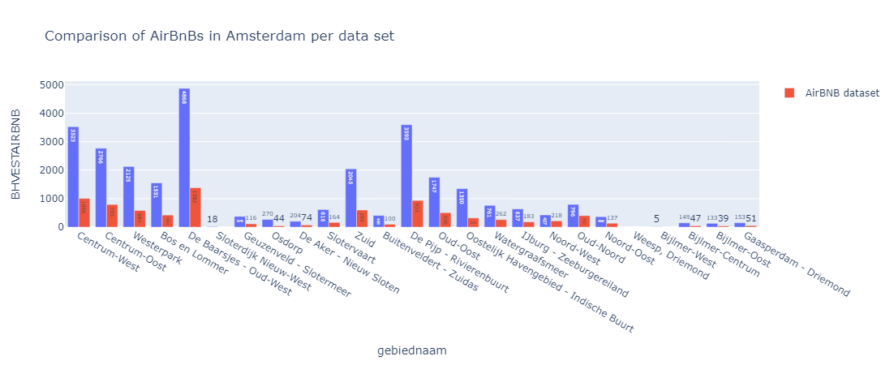

### What Amsterdam will receive from tourist tax if the event lasts a week and you will have 30.000 visitors?
We can calculate the tourist tax with a simple sum. 3 euros times 30.000 visitors times six nights.
```python
tourist_tax = 3 * 30000 * 6
print(tourist_tax, "euros")
```
`540000 euros`

### Plot the amount of AirBnB locations per neighbourhood.
We can plot the amount of AirBNB location by neighbourhood using the following code:
```python
airbnb_df = pd.read_csv('./listings.csv')
bbga_df = pd.read_csv('./bbga.csv', sep=';')
df_neighbourhood = airbnb_df['neighbourhood'].value_counts().reset_index().rename(columns={'index': 'neighbourhood', 0 : 'count'})
figure = px.bar(df_neighbourhood, x='neighbourhood', y='count')
figure.show()
```

First, we read the airbnb dataset which we downloaded from the airbnb scraper website. Then, we use `value_counts` to create a new dataframe that contains the count of each occurance of a specific neighbourhood. We plot this new dataframe in a histogram using plotly express.

### Which street in Amsterdam has the most AirBnB apartments?
We were unable to complete this assignment, because it required reverse geocoding which is a paid service. Using google maps API, it would have costed about 40$. Free solutions were inadequate, because they disallow bulk API requests.

### Try to cross reference the data from the AirBnB dataset with the BBGA. Can you figure out if all apartments of AirBnB are designated as housing? Which number of apartments are not rented out all the time but are also used as normal housing?
First, we filter the BBGA and select only the rows with relevant data:
```python
bbga_airbnb_df = bbga_df[['gebiednaam', 'sdnaam', 'BHVESTAIRBNB']]
bbga_airbnb_df_GWW = bbga_airbnb_df.iloc[3937:3962]
bbga_airbnb_df_GWW.to_csv("bbga_short.csv", index = False)
```
Then, we need to rename the rows in the BBGA file to be the same as those in the airbnb file.
```python
bbga_short_df = pd.read_csv('./bbga_short.csv')
bbga_short_df.replace({ "Oud West, De Baarsjes" :"De Baarsjes - Oud-West",
            "De Pijp, Rivierenbuurt":"De Pijp - Rivierenbuurt",
            "Indische Buurt, Oostelijk Havengebied" : "Oostelijk Havengebied - Indische Buurt",
            "IJburg, Zeeburgereiland" : "IJburg - Zeeburgereiland",
            "Geuzenveld, Slotermeer" : "Geuzenveld - Slotermeer",
            "Buitenveldert, Zuidas" : "Buitenveldert - Zuidas",
            "Oud-Zuid" : "Zuid" ,
            "De Aker, Sloten, Nieuw-Sloten" : "De Aker - Nieuw Sloten",
             "Gaasperdam" : "Gaasperdam - Driemond"}, inplace = True)
```
Next, we plot the two files together in a bar graph using plotly express.
```python
graph = px.bar(bbga_short_df, x='gebiednaam', y='BHVESTAIRBNB', barmode='group')
graph.add_bar(x=df_neighbourhood['neighbourhood'], y=df_neighbourhood['count'])
graph.show()
```

The BBGA dataset is in blue, the airbnb dataset is in red.

To see wether or not an airbnb be is also used a as a house we consider the vairbale availabilit_365. This variable presumably showes how many days a place is available on airbnb and thus to what extend it is also used for other means.
```python
airbnb_df.hist(column='availability_365', bins=[0, 5, 10, 20, 30, 40, 50, 60, 70, 80, 90, 100, 110, 120, 130, 140, 150, 160, 170, 180, 190, 200, 210, 220, 230, 240, 250, 260, 270, 280, 300, 310, 320, 330, 340, 350, 360, 370])

# Set the title and axis labels
plt.title('Days Airbnb is available')
plt.xlabel('number of days')
plt.ylabel('amount of airbnbs')
```


From this, we can conclude that the vast majority of airbnb's are available only some days in a year, with a lot of them almost never available. 

### How many hotel rooms should be built if Amsterdam wants to accommodate the same number of tourists?