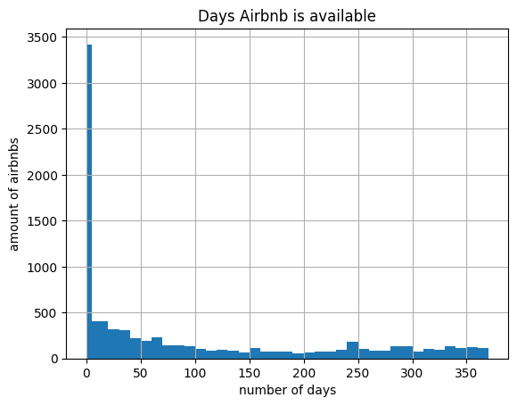

### What Amsterdam will receive from tourist tax if the event lasts a week and you will have 30.000 visitors?
We can calculate the tourist tax with a siple calculation using the airbnb data. (City of Amsterdam, n.d.).
```python
# In amsterdam the tax is 3 euros and we assume a stay of 6 night since the arrival and depature day would be included in the 7
tourist_tax = 3 * 30000 * 6

# Furthermore, there is a tax of 7% on the price of the room
# To calculate this, we first calculate the average price of an airbnb per night
airbnb_avg_price = np.average(airbnb_df['price'])

# If we consider that, on average, 2 people will stay per AirBNB, we can calculate the total tax
tax_room = 0.07 * airbnb_avg_price * 15000 * 6

# So if all 30 000 visitors would stay in an AirBNB, the total tax would be:
print("The total tourist tax earned by Amsterdam from the 30.000 visitors would be: " + str(np.round(tourist_tax + tax_room)) + "€")
```
`The total tourist tax earned by Amsterdam from the 30.000 visitors would be: 2143286.0€`

### Plot the amount of AirBnB locations per neighbourhood.
We can plot the amount of AirBNB location by neighbourhood using the following code (Gemeente Amsterdam, 2023):
```python
airbnb_df = pd.read_csv('./listings.csv')
bbga_df = pd.read_csv('./bbga.csv', sep=';')
df_neighbourhood = airbnb_df['neighbourhood'].value_counts().reset_index().rename(columns={'index': 'neighbourhood', 0 : 'count'})
figure = px.bar(df_neighbourhood, x='neighbourhood', y='count')
figure.show()
```
<iframe src="./embeds/airbnb_distribution.html" height="300" width="100%" style="border:none"></iframe>
First, we read the airbnb dataset which we downloaded from the airbnb scraper website. Then, we use `value_counts` to create a new dataframe that contains the count of each occurance of a specific neighbourhood. We plot this new dataframe in a histogram using plotly express.

### Which street in Amsterdam has the most AirBnB apartments?
We need to find the street address for each of the AirBNB listings in the database. To do this, we first put all of the coordinates of the listings into a dataframe.
```python
from geopy.geocoders import Nominatim
airbnb_df["coord"] = airbnb_df.latitude.astype(str) + ", " + airbnb_df.longitude.astype(str)
coordinates = airbnb_df["coord"].tolist()
result = []
```
Then, we use Nominatim to find the addresses for each of the coordinate points in the dataframe. We format the resulting data, and then add it to a list with all of the addresses.
```python
geolocator = Nominatim(user_agent="#####")
for i in coordinates:
    address = geolocator.reverse(i)
    split_data = address.address.split(',')
    short_data = split_data[:7]
    result.append(short_data)
```
However, the formatting for each of the list items is not machine-readable. To be able to parse this information, we use a visual inspection to conclude that the street name is in one of the first three columns. So we then we createa new list which only includes the vairbales within the first 3 colums, then we count how many times each individual items show up. From here we print the top of the value count list and scan for the firt item which is a street name and and how often it appears.

```python
adresses_rel = pd.concat([adresses['1'], adresses['2'], adresses['3']])
count = adresses_rel.value_counts()
```
`The street Nassaukade has the most AirBNB's, with 183 registered listings. `

### Try to cross reference the data from the AirBnB dataset with the BBGA. Can you figure out if all apartments of AirBnB are designated as housing? Which number of apartments are not rented out all the time but are also used as normal housing?
First, we filter the BBGA and select only the rows with relevant data:
```python
bbga_airbnb_df = bbga_df[['gebiednaam', 'sdnaam', 'BHVESTAIRBNB']]
bbga_airbnb_df_GWW = bbga_airbnb_df.iloc[3937:3962]
bbga_airbnb_df_GWW.to_csv("bbga_short.csv", index = False)
```
Then, we need to rename the rows in the BBGA file to be the same as those in the airbnb file.
```python
bbga_short_df = pd.read_csv('./bbga_short.csv')
bbga_short_df.replace({ "Oud West, De Baarsjes" :"De Baarsjes - Oud-West",
            "De Pijp, Rivierenbuurt":"De Pijp - Rivierenbuurt",
            "Indische Buurt, Oostelijk Havengebied" : "Oostelijk Havengebied - Indische Buurt",
            "IJburg, Zeeburgereiland" : "IJburg - Zeeburgereiland",
            "Geuzenveld, Slotermeer" : "Geuzenveld - Slotermeer",
            "Buitenveldert, Zuidas" : "Buitenveldert - Zuidas",
            "Oud-Zuid" : "Zuid" ,
            "De Aker, Sloten, Nieuw-Sloten" : "De Aker - Nieuw Sloten",
             "Gaasperdam" : "Gaasperdam - Driemond"}, inplace = True)
```
Next, we plot the two files together in a bar graph using plotly express.
```python
graph = px.bar(bbga_short_df, x='gebiednaam', y='BHVESTAIRBNB', barmode='group', title="Comparison of AirBnBs in Amsterdam per data set", text_auto=True)
graph.add_bar(x=df_neighbourhood['neighbourhood'], y=df_neighbourhood['count'], name="AirBNB dataset", text=df_neighbourhood['count'])

graph.show()
```
<iframe src="./embeds/comparison.html" height="300" width="100%" style="border:none"></iframe>
The BBGA dataset is in blue, the airbnb dataset is in red.

To see wether or not an airbnb be is also used a as a house we consider the vairbale availabilit_365. This variable presumably showes how many days a place is available on airbnb and thus to what extend it is also used for other means.
```python
airbnb_df.hist(column='availability_365', bins=[0, 5, 10, 20, 30, 40, 50, 60, 70, 80, 90, 100, 110, 120, 130, 140, 150, 160, 170, 180, 190, 200, 210, 220, 230, 240, 250, 260, 270, 280, 300, 310, 320, 330, 340, 350, 360, 370])

# Set the title and axis labels
plt.title('Days Airbnb is available')
plt.xlabel('number of days')
plt.ylabel('amount of airbnbs')
```


From this, we can conclude that the vast majority of airbnb's are available only some days in a year, with a lot of them almost never available. 

This is also the reason why the BBGA comes out so much higher than the airbnb listings. The BBGA data is for the whole year where the data was collected, while the AirBNB listings is a snapshot of the site at the moment we download the data.

### How many hotel rooms should be built if Amsterdam wants to accommodate the same number of tourists?
We create a new list with only airbnbs which have been online for more than 0 nights so minimum 1 day, and then we count how many items are in our list to see how many airbnbs this counts for.
```python
airbnb_more = airbnb_df[airbnb_df['availability_365'] > 0]
airbnb_available = len(airbnb_more)
print(airbnb_available)
# Some numbers show that the average bnb offers around 3 rooms, so we will assume 3 guests to anser this question
people_airbnb = airbnb_available * 3
print(people_airbnb)
# Standard hotel rooms have 2 beds which is the assumption for the next calculaition
hotel_rooms = people_airbnb/2
print(hotel_rooms)
```
`5438,
16314,
8157.0`

### How many different licenses are issued?
If we remove duplicate licenses, the length of the list will be the amount of different licenses.
```python
airbnb_df
license = list(set(airbnb_df["license"])) 
print("The number of licences after removing duplicates:" + str(len(license)))
```
`The number of licences after removing duplicates :7289`

### References

City of Amsterdam. (n.d.). Tourist tax (toeristenbelasting). https://www.amsterdam.nl/en/municipal-taxes/tourist-tax-(toeristenbelasting)/

Gemeente Amsterdam. (2023, June 15). Data en informatie. https://data.amsterdam.nl/datasets/rl6-35tFAw2Ljw/basisbestand-gebieden-amsterdam-bbga/