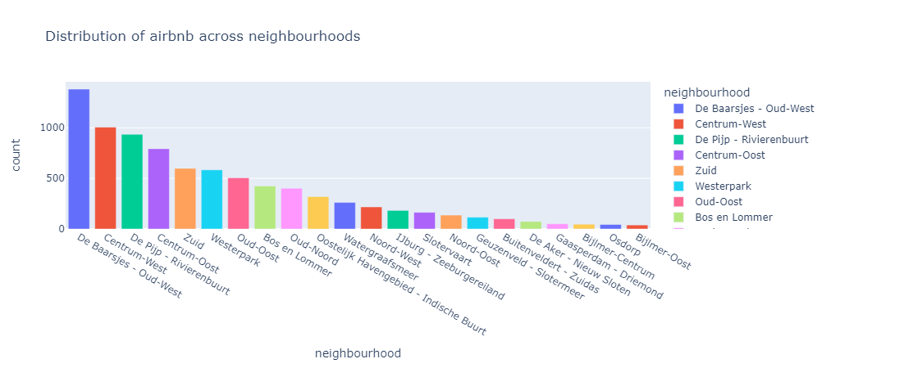

### What Amsterdam will receive from tourist tax if the event lasts a week and you will have 30.000 visitors?
We can calculate the tourist tax with a simple sum. 3 euros times 30.000 visitors times six nights.
```python
tourist_tax = 3 * 30000 * 6
print(tourist_tax, "euros")
```
`540000 euros`

### Plot the amount of AirBnB locations per neighbourhood.
We can plot the amount of AirBNB location by neighbourhood using the following code:
```python
airbnb_df = pd.read_csv('./listings.csv')
bbga_df = pd.read_csv('./bbga.csv', sep=';')
df_neighbourhood = airbnb_df['neighbourhood'].value_counts().reset_index().rename(columns={'index': 'neighbourhood', 0 : 'count'})
figure = px.bar(df_neighbourhood, x='neighbourhood', y='count')
figure.show()
```

First, we read the airbnb dataset which we downloaded from the airbnb scraper website. Then, we use `value_counts` to 