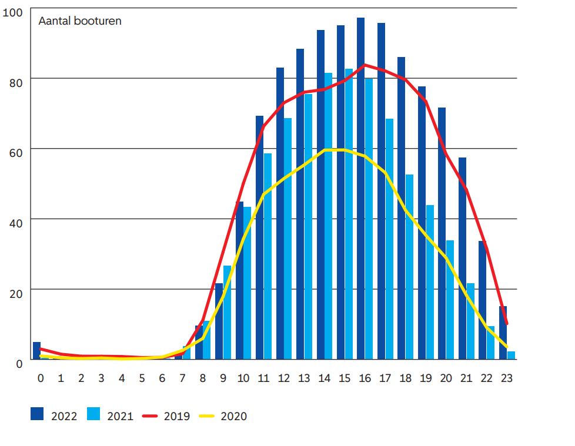
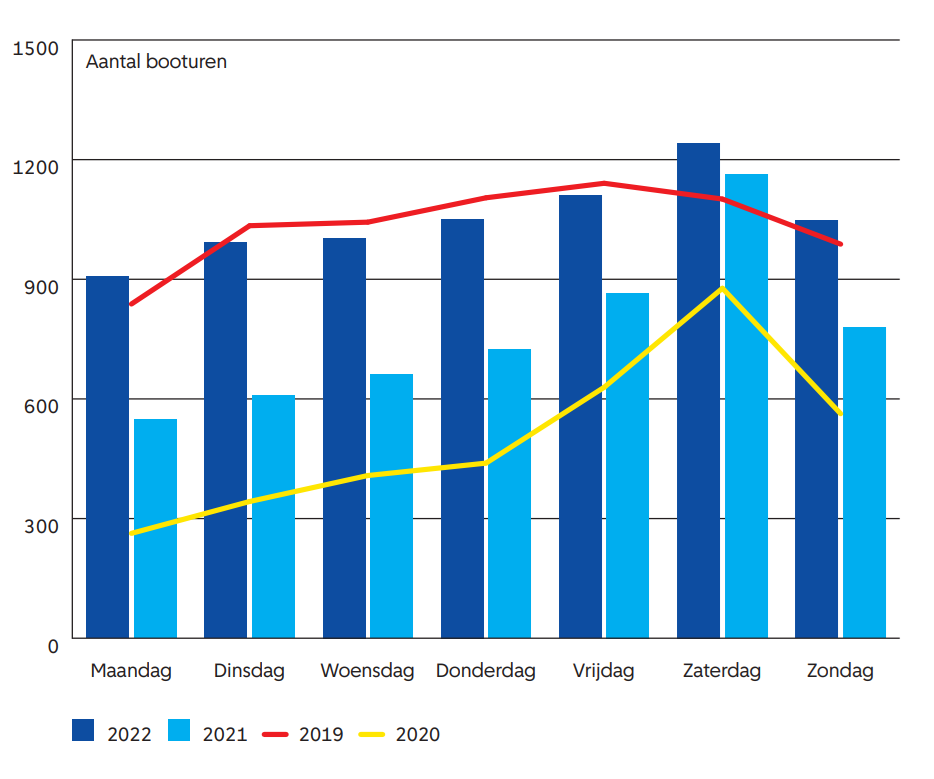

### How many of the canal boats currently in use are diesel/fossil fuel driven and how many boats are electrical driven?
Amsterdam as a city is very proud of their canals and a prominent tourist attraction is taking canal boats in Amsterdam. By 2025 Amsterdam aims their boat fleet to become fully electric but current numbers show that we are still far away (TNO, 2023). In 2023 there estimated of 7350 boats for pleasure time in Amsterdam, off these 15% are estimated to be emission free and 42.5% are using gas while another 42.5 is using diesel (TNO, 2023). This would mean that around 1102 boats are currently electric in the canals of Amsterdam (TNO, 2023).

```python
electric_boats = 7350 * 0.15
```

Overall, the industry is assumed to emit 243 tons Co2 1.893 kg NOx and 205 kg PM (TNO, 2023). This includes emissions outside of the canals themselves such as in the IJ (TNO, 2023). 

### Are there peak times for the canal boats? 

From the report by the Gementee Amsterdam we can see that the peak hours for leisure transport is between 14-18. The canal tours generally start aorund 8 and the see a steady increase (Gemeente Amsterdam, n.d.). 



Furthermore, we can see that in general monday has somewhat less boats, and every day after sees an increase (Gemeente Amsterdam, n.d.). 



### Try to compare the energy use of the canal boats to some other activities in the city. Use canal boats more or less energy in relation to their carbon footprint compared to these other activities?
The energy consumption of a canal boat at cruising speeds is about 1 liter of diesel fuel per hour (ABC boat hire, n.d.). The energy density of diesel is 45.3 MJ/kg, and the volumetric density of diesel is about 875 kg/m^3 . Combining these numbers, we get a volumetric energy density of 45.3*875=39637.5 MJ/m^3  or 39.6 MJ/L (Boat Fuel Economy, n.d.). This means that the canal boat consumes 39.63 MJ per hour of travel. Considering that the max speed of boats in Amsterdam is 7 km/h, energy consumption per kilometre is 39.63/7=5.66 MJ (Boat Fuel Economy, n.d.). Please note that this is the total amount of energy present in the diesel fuel being consumed, modern diesel engines achieve conversion efficiencies of about 45% so the amount of energy converted into thrust is lower.

| Activity        | Energy consumption (/km) | Carbon Emissions (/km) |
|:-------------|:------------------|:------|
| Canal boats           | 1.572 kWh | 2.6 kg  |
| Hop on hop off bus | 1.917 kWh   | 3 kg  |
| Bike tours           | 0 kWh  | 0 kg   |

Amsterdam's iconic canal boats have been under scrutiny for their energy use and carbon footprint in comparison to other city activities. These boats consume 1 liter of diesel fuel per hour. When compared to hop-on-hop-off buses, canal boats are more energy-efficient, using 1.572 kWh and emitting 2.6 kg of carbon per kilometer, while buses consume 1.917 kWh and produce 3 kg of carbon (Kammuang-lue & Boonjun, 2019). Bike tours, being emission-free, offer the most eco-friendly option. 

### Would you consider it economically feasible?
Well, it depends on what you mean by ‘it’.... But if I have to consider whether changing diesel motors in canal boats to an electric alternative, it would be this: the costs of the replacement varies between 15.000 and 50.000 euro. When considering a fleet where there are still 6247 boats which are diesel or gas driven that means a minimum replacement cost of 93.705.000 euros. Whether this is feasible depends on the investment capacity of the canal boat companies. There are also some variables in the charging capacity. In practice, most canal boats would be able to ride for about 8 hours with on a full battery. Now, they travel for about 10-12 hours (possible with tanking). This means that companies might not be able to get the same profit per day with electric vehicles unless they invest in larger accu’s.

### How many support boats and vehicles are needed for the Paralympics event only. 
On average you need 12 swimmers per support craft(). In previous years, only 32 people participated in the 5 km event at the IPC world championship in swimming and now 5 km race has been seen in the previous Paralympics to compare (). This would mean that we would need at least 3 support crafts and then we could even host 4 more participants if needed. Likely however there would be some more support vessels as videos from previous event show around 8-9 vessels.

### If only clean energy can be used, how many solar panels or wind turbines are needed?
As stated in the previous question, three support crafts will be used. We can assume that we will use the boats for 4h during this day to move the athletes. This means that the boat canals will be running for 12h and they need 1.572kWh/h, leading to an energy need of 18.864 kWh for the event. One WP of solar panels generates 0.9 kWh of energy per year in the Netherlands. Therefore, we will need 20.96 (21) WP of solar panels to power the boats or we could use a whole solar panel (300WP), but we will only need to use it for a month to power the boats. 

### Is it possible to accommodate these facilities within the city? 
To power the three crafts boats, we will only need one solar panel running for a month. As there are still plenty of suitable roofs in the city, it is safe to assume that we could easily find a place for the solar panel. Another option would be to install the solar panel directly on the boats. Indeed, more and more boats are doing this alternative. 

### Would there be any effect on the water quality if there are less/no canal boats using fossil fuels?
Based on previous research, we assume that while removing fossil fuel riven boats from the canals will reduce the amount of leakage in the canals it's not relevant to current pollution issues. Previous measurement of water quality focus predominantly of e.coli and blue alga. These are mostly caused by sewage water overflowing and warmth and fertilizer in the water. Thus, while it would make the water cleaner it's not the most prominent issue at the moment.

### References
ABC boat hire. (n.d.) How much fuel does a narrowboat use? - . ABC Boat Hire | ABC Boat Hire. https://www.abcboathire.com/blog/how-much-fuel-does-a-narrowboat-use 

Boat Fuel Economy. (n.d.). Liters: Mercury - evinrude - yamaha - suzuki - honda - tohatsu - outboard fuel consumption per hour LPH. Liters | Mercury - Evinrude - Yamaha - Suzuki - Honda - Tohatsu - Outboard Fuel Consumption per Hour LPH. https://www.boat-fuel-economy.com/outboard-fuel-consumption-liters 

Gemeente Amsterdam. (n.d.). Grachtenmonitor 2022. openresearch.amsterdam. https://openresearch.amsterdam/nl/page/92981/grachtenmonitor-2022 

Kammuang-lue, N. & Boonjun, J. (2019). Simulation and comparison on energy consumption between electric and diesel buses: Feasibility Study on electric rubber-tire bus potential in Chiang Mai. 2019 IEEE 10th International Conference on Mechanical and Aerospace Engineering (ICMAE). https://doi.org/10.1109/icmae.2019.8880940 

TNO. (2023, May 25). Uitvoeringsagenda Uitstootvrije Mobiliteit - assets.amsterdam.nl. https://assets.amsterdam.nl/publish/pages/863561/tno-rapport_uitvoeringsagenda_uitstootvrije_mobiliteit-pdf2.pdf 